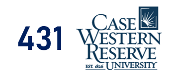

# 431-slides-2022

This is the repository for Dr. Love's class slides for 431 in Fall 2022.

The main page for the course is https://thomaselove.github.io/431-2022/

- The **HTML Link to Slides** provides the version of the slides I suggest you focus on during class.
- The Quarto file links provide the code I used (in [Quarto](https://quarto.org/)) to build the slides.

Class | HTML Link to Slides | Date | Quarto file
:---: | :------------: | :---: | :--------------:
01 | [Slides for Class 01](https://thomaselove.github.io/431-slides-2022/class01.html) | 2022-08-30 | [Quarto for Class 01 slides](class01.qmd)
02 | [Slides for Class 02](https://thomaselove.github.io/431-slides-2022/class02.html) | 2022-09-01 | [Quarto for Class 02 slides](class02.qmd)
03 | [Slides for Class 03](https://thomaselove.github.io/431-slides-2022/class03.html) | 2022-09-06 | [Quarto for Class 03 slides](class03.qmd)
04 | [Slides for Class 04](https://thomaselove.github.io/431-slides-2022/class04.html) | 2022-09-08 | [Quarto for Class 04 slides](class04.qmd)

This repository can also be viewed at https://thomaselove.github.io/431-slides-2022/

